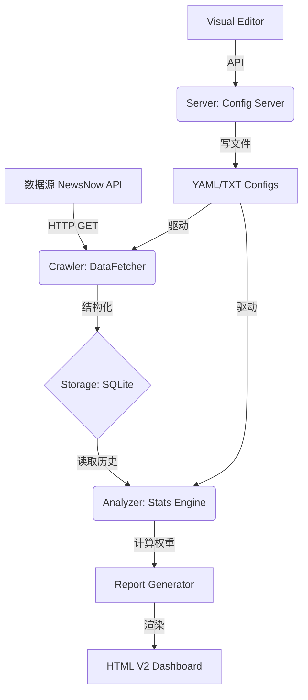

# TrendRadar 深度开发复盘与全量技术手册 / Deep Development Retrospective & Full Technical Manual

## 0. 文档维护规范 / Documentation Maintenance Standards

> [!IMPORTANT]
> 为确保 TrendRadar 长期可维护性及知识沉淀，本手册的任何增补或修改必须严格遵守以下准则：
> To ensure long-term maintainability and knowledge retention, any additions or modifications to this manual must strictly adhere to the following guidelines:

1. **双语强制原则 (Mandatory Bilingual)**: 所有标题、描述、技术说明必须采用 **“中英文对照”** 格式。 (All headers, descriptions, and technical notes must be bilingual.)
2. **元数据闭环 (Metadata Closed-Loop)**: 任何功能修改后，必须同步更新 `1. 元数据` 中的 **“更新历史 (Update History)”**，记录精确时间及变动摘要。 (Any functional changes must be synchronized in the "Update History" within Section 1.)
3. **技术深度导向 (Technical Depth)**: 严禁只记录“做了什么 (What)”，必须记录 **“怎么做的 (How)”**。更新内容应包含极其明确的描述：涉及的文件路径、核心算法、逻辑流转、数据契约或设计要求的变化。 (Do not only record "What"; you must record "How," including file paths, algorithms, logic flows, data contracts, or changes in design requirements.)
4. **故障复盘五要素 (5-Element Bug Retro)**: 凡是在开发过程中遇到的非预期问题或 Bug，必须按以下结构完整描述：
   - **表现 (Symptoms)**: 观测到的错误现象及触发场景。
   - **原因 (Cause)**: 导致问题的技术根源及第一性原理分析。
   - **修复 (Fix)**: 具体的代码级解决方案。
   - **预防 (Prevention)**: 如何在设计或流程上避免此类问题再次发生。
   - **结果 (Result)**: 修复后的实际效果及验证数据。
   (Any bugs must be described using: Symptoms, Cause, Fix, Prevention, and Result.)
5. **结构化递增 (Structured Incremental)**: 保持目录结构整齐，新增大型功能模块应新增二级/三级标题，并同步更新项目结构树。 (Keep the directory structure organized. New major modules should have dedicated headers and update the project structure tree.)

---

## 1. 元数据 / Metadata
- **创建记录 (Creation Record)**: 2026-03-13 12:05 | Antigravity | /TrendRadar/docs/202603131205 Development_Retrospective.md
- **更新历史 (Update History)**: 
  - 2026-03-13 14:45: 集成 AI 提示词编辑器及全站 7 大配色方案。 (Integrated AI Prompt Editors and 7 Global Color Schemes.)
  - 2026-03-14 12:00: 增强 AI 渲染引擎，支持 Markdown 解析；优化模型选择器，增加阿里云预设及自定义模型输入；记录 Docker 环境热更新排障经验。 (Enhanced AI rendering engine with Markdown support; optimized model picker with Aliyun presets and custom input; documented Docker hot-reload troubleshooting.)
  - 2026-03-14 19:45: 修复 AI 提示词 [user] 标签缺失问题；新增”SAVE & RUN (立即分析)”功能，打通”保存-触发后验-即时反馈”链路。 (Fixed missing [user] tag in AI prompts; added “SAVE & RUN” feature to bridge the gap between saving and immediate analysis feedback.)
  - 2026-03-14 20:00: 优化编辑器导航栏排版，解决按钮拥挤问题；修复 AI 模型提供商缺失导致的 BadRequestError，增强模型选择引导。 (Optimized editor nav layout; fixed BadRequestError by asserting provider prefixes; enhanced model selection guidance.)
  - 2026-04-09 09:55: 优化 AI 分析卡片布局，实现 600px 固定高度及内容滚动；修复大模型名称显示为 “Unknown” 的问题，实现模型名称实时同步；改进提示词指令，增强 AI 分析内容的分段逻辑。 (Optimized AI analysis card layout with 600px fixed height and content scrolling; fixed “Unknown” model name display with real-time sync; improved prompt instructions for better content segmentation.)
  - 2026-04-19 15:30: 修复可视化配置中心的锁定编辑功能；增强右侧配置面板的禁用状态显示；修复 AI 提示词编辑器的滚动同步问题。 (Fixed lock edit functionality in visual config center; enhanced disabled state display for right panels; fixed scroll sync for AI prompt editors.)
  - 2026-04-19 16:00: 增强保存方案功能，支持方案列表显示与覆盖确认；更新品牌名称为 AiYX Data Radar；更新主页面标题和版本号。 (Enhanced profile save feature with list display and overwrite confirmation; updated brand name to AiYX Data Radar; updated homepage title and version.)
  - 2026-04-19 17:15: 实现 AI 模型查询功能，支持多服务商（SiliconFlow/OpenAI/DeepSeek/Zhipu）的连接测试、模型列表获取、自动配置填充；修正 AI 配置格式（deepseek-ai/deepseek-v3）和 temperature 参数（1）；添加详细的功能规范文档。 (Implemented AI model query feature supporting multiple providers with connection testing, model list fetching, and auto-config population; corrected AI config format and temperature parameter; added detailed feature specification documentation.)
  - 2026-04-23 08:54: 修复 Nginx 反向代理端口配置错误（8084 → 8080），解决 502 Bad Gateway 问题；修复数据库查询字段不匹配（published_at → first_crawl_time），确保所有 API 功能正常工作；更新部署配置文档。 (Fixed Nginx reverse proxy port configuration (8084 → 8080) to resolve 502 Bad Gateway; fixed database query field mismatch (published_at → first_crawl_time) to ensure all APIs work correctly; updated deployment configuration documentation.)
  - 2026-04-24 15:52: 修复配置文件读取失败问题，调整 CONFIG_DIR 路径检测顺序（/TrendRadar/config 优先于 /app/config），解决配置编辑器无法加载配置文件的问题；验证所有配置文件（config.yaml、frequency_words.txt、timeline.yaml、ai_analysis_prompt.txt、ai_translation_prompt.txt）均可正常读取。 (Fixed configuration file read failure by reordering CONFIG_DIR path detection (/TrendRadar/config prioritized over /app/config); verified all config files load successfully.)
  - 2026-04-24 16:30: 优化 AI 模型查询弹出框，添加搜索过滤功能和可调整大小功能；增强拖拽区域可视化（40px × 40px 渐变三角形），提升用户体验。 (Optimized AI model query modal with search filtering and resizable functionality; enhanced drag area visualization (40px × 40px gradient triangle) for better UX.)
  - 2026-04-26 21:40: 修复手动刷新按钮失效问题，将 `manage.py` 中的硬编码路径从 `/AIYXDATA-TRADAR` 修正为动态探测的 `/app`；修复新增 RSS 源不显示问题，将 `huxiu` 和 `timednews` 同步至 `standalone` 显示白名单。 (Fixed manual refresh button failure by correcting hardcoded path in `manage.py` to dynamic `/app`; fixed missing RSS source display by syncing `huxiu` and `timednews` to the `standalone` display whitelist.)
  - 2026-05-11 19:00: 修复模型查询功能的容器部署问题和多格式兼容性问题；解决 Docker 容器工作目录导致的代码版本不一致；增强后端模型提取逻辑支持多种 API 格式；实现自动重试 /v1 路径；优化前端模态框交互体验；完善错误处理机制。 (Fixed model query feature container deployment and multi-format compatibility issues; resolved code version inconsistency caused by Docker working directory; enhanced backend model extraction to support multiple API formats; implemented auto-retry for /v1 path; optimized frontend modal interaction; improved error handling mechanism.)

- **技术栈信息 (Tech Stack)**:
  - **核心框架 (Core Framework)**: Python 3.10+, HTML5, Vanilla CSS, Vanilla JavaScript
  - **核心依赖 (Key Dependencies)**: 
    - `js-yaml`: 4.1.0 (YAML 解析 / YAML Parsing)
    - `SortableJS`: 1.15.2 (拖拽排序 / Drag-and-drop sorting)
    - `Tailwind CSS`: 3.4.1 (UI 样式 / UI Styling)
    - `marked.js`: 12.0.0 (Markdown 前端解析 / Frontend Markdown parsing)
    - `html2canvas`: 1.4.1 (长图导出 / Long image export)
    - `FontAwesome`: 6.4.0 (图标库 / Icon Library)
  - **开发工具 (Dev Tools)**: Node.js 18.x, npm 9.x

- **平台信息 (Platform Info)**:
  - **开发环境 (Dev Environment)**: Linux, VSCode/Antigravity
  - **部署平台 (Deployment)**: Docker 24.0+, Nginx 1.24+
  - **构建与 CI/CD**: Docker Compose, GitHub Actions (Ready)

## 2. 系统架构深度解析 / System Architecture Deep Dive

### 2.1 整体架构图 / Overall Architecture


### 2.2 核心模块职责 / Core Module Responsibilities
- **`crawler/fetcher.py`**: 负责网络通信及 API 对接。具备自动重试（随机退避算法）和 JSON 安全解析功能。 (Handles networking and API integration. Features automatic retries with random backoff and safe JSON parsing.)
- **`core/analyzer.py`**: 系统大脑。负责关键词匹配（正则支持）、权重计算及 RSS 频率统计。 (The brain. Handles keyword matching (Regex support), weight calculation, and RSS frequency stats.)
- **`report/html_v2.py`**: UI 展示层。采用明亮科技感设计，内置配置编辑器前端逻辑。 (UI layer. Uses "Bright Tech" design with built-in Visual Editor frontend logic.)

## 3. 技术规格详解 / Technical Specifications

### 3.1 权重算法 / Weighting Algorithm
系统基于以下公式计算新闻热度（用于排序）：
The system calculates news hotness (for sorting) based on the following formula:
`Total_Weight = (Rank_Score * 0.4) + (Freq_Score * 0.3) + (Hotness_Score * 0.3)`
- **Rank_Score**: `Σ(11 - min(rank, 10)) / 出现次数`.
- **Freq_Score**: `min(出现次数, 10) * 10`.
- **Hotness_Score**: 高排名（<阈值）占比加成。 (High rank percentage bonus.)

### 3.2 数据库模式 (Schema) / Database Schema
- **`news_items`**: 以 `url + platform_id` 为唯一索引，支持无损去重。 (Uses `url + platform_id` as unique index for lossless deduplication.)
- **`rank_history`**: 存储时间序列排名，支持生成热度走势。 (Stores time-series rankings for hotness trend generation.)
- **`period_executions`**: 确保 `ONCE_PER_DAY` 逻辑，防止重复推送。 (Ensures `ONCE_PER_DAY` logic to prevent redundant pushes.)
- **`ai_analysis_cache`**: 缓存 AI 处理结果，避免重复请求产生的 Token 消耗。 (Caches AI results to avoid redundant token consumption.)

### 3.4 AI 分析容错机制 / AI Analysis Fault Tolerance
- **长文本截断优化**: 在 `analyzer.py` 的 JSON 解析异常处理中，将原始响应回退长度从 500 个字符提升至 **3000 个字符**。
- **原始回退逻辑**: 即使 AI 返回的不是标准 JSON，系统也会完整保留分析的核心观点并传递给前端进行二次渲染。 (Even if the AI returns non-standard JSON, the system preserves core insights for frontend rendering.)
- **元数据同步机制**: 在 `AIAnalysisResult` 中引入 `metadata` 字段，用于传递模型 ID 等运行态参数，解决前端显示 "Unknown" 的状态丢失问题。具体数据流：`config.yaml` 注入 -> `analyzer.py` 捕获 -> `metadata` 字典存储 -> `html_v2.py` 优先检索渲染。 (Introduced `metadata` in `AIAnalysisResult` for runtime sync. Data flow: `config.yaml` -> `analyzer.py` -> `metadata` dict -> `html_v2.py` rendering.)
- **AI 分析分段逻辑 (Prompt Segmentation Logic)**: 
  - **设计变更 (Design Change)**: 优化 `config/ai_analysis_prompt.txt`，将“严禁 Markdown”微调为“允许字段内使用 Markdown 列表及 \n 换行”，并注入“强制分段指令”。 
  - **核心理由 (Rationale)**: 解决长文在大模型生成时出现的“文字墙”问题，通过 JSON 字段内的结构化文本提升可读性。
  - **约束 (Constraint)**: 必须保持纯 JSON 输出，严禁包含任何 Markdown 代码块包裹层。

### 3.3 Web API 接口文档 / Web API Documentation
| 路径 / Path | 方法 / Method | 说明 / Description | 请求体示例 / Payload Example |
| :--- | :--- | :--- | :--- |
| `/api/load` | GET | 加载主配置列表 | N/A |
| `/api/save` | POST | 覆盖主配置文件 | `{"file": "config", "content": "..."}` |
| `/api/profiles/save` | POST | 保存为快照方案 | `{"name": "方案A", "content": {...}}` |
| `/api/refresh` | POST | 立即触发数据刷新 | `{}` |

## 4. 主页排版与视觉设计 / Homepage Layout & Visual Design

### 4.1 视觉风格与美学 / Visual Style & Aesthetics
- **设计主题**: 明亮科技风 (Bright Tech Style)。结合了简约的明亮底色与充满未来感的“霓虹色系”装饰。
- **色彩规范 (Neon Palette)**:
  - **青色 (#00f2ff)**: 核心强调色，用于顶部边框、进度条及重要图标。
  - **洋红 (#ff00ff)**: 辅助色，用于点缀和背景渐变。
  - **青柠 (#39ff14)** & **阳光黄 (#fff01f)**: 用于不同的分类卡片，增加视觉丰富度。
- **背景设计**: 采用双重径向渐变（Radial Gradient），左上角青色微光与右上角洋红微光交织，营造动态深度感。

### 4.2 核心组件设计 / Core Component Design
- **页头 (Hero Header)**:
  - **卡片式承载**: 位于页面顶部，采用 24px 大圆角设计，具有 `shadow-md` 阴影。
  - **元数据框 (Meta Box)**: 内部嵌套灰色背景的 `meta-box`，展示“节点状态”、“新闻总数”、“热点个数”及“生成时间”。
- **信息卡片 (Topic Cards)**:
  - **瀑布流网格**: 采用 `grid-template-columns: repeat(auto-fill, minmax(350px, 1fr))` 实现自适应排版。
  - **固定高度滚动**: 卡片高度固定为 600px，内部主体使用自定义极简滚动条，确保即使新闻项再多也能保持整体布局整齐。
  - **动态悬浮效果**: 悬浮时触发 `translateY(-8px)` 和增强阴影，增强层级感。
- **新闻项设计 (News Item)**:
  - **精简元数据**: 每条新闻包含序号、标题、出处 Tab 及 **🕒 相对/绝对时间标签**。
  - **智能截断**: 标题采用 `-webkit-line-clamp: 2` 自动截断，确保间距统一。

### 4.3 增强交互模式 / Enhanced Interactive Patterns
- **玻璃拟态 (Glassmorphism)**: AI 深度分析区域采用 `backdrop-filter: blur(12px)` 和半透明背景，突出其“智能助手”的高级感。
- **响应式适配**: 
  - **移动端优化**: 当屏幕宽度 < 900px 时，页头按钮自动堆叠，元数据框进入 `flex-wrap` 模式。
  - **自适应网格**: 卡片宽度根据屏幕宽度自动调整列数，完美适配 Pad 与 Mobile。

### 4.4 AI 深度分析渲染引擎 / AI Analysis Rendering Engine
- **Markdown 集成**: 通过在 `html_v2.py` 中引入 `marked.js`，实现了标题、列表、加粗及代码块的原生 Markdown 渲染。 (Implemented native Markdown rendering for headings, lists, and code blocks via `marked.js` in `html_v2.py`.)
- **数据流转安全**: 原始 AI 文本首先注入隐藏的 `<textarea>`，再由脚本异步解析并注入渲染容器，确保了复杂字符（如引号、反斜杠）的安全显示。 (Raw AI text is injected into a hidden `<textarea>` before being parsed asynchronously, ensuring safe display of complex characters.)
- **AI 卡片框架重构 (AI Card Refactoring)**:
  - **设计规范 (Design Spec)**: 废弃原始的 `.ai-card` 独立内边距样式，将其重构为遵循 `.card` 全局规范的 `header` + `body` 结构。 
  - **结构实现 (Structure)**: 采用 `<div class="card-header">` 承载标题与模型名称，使用 `<div class="card-body">` 包裹 Markdown 容器。
  - **滚动控制 (Scroll Control)**: 在 `.ai-card` 上显式设置 `height: 600px` (与新闻卡片对齐)，并在对应的 `.card-body` 中由 `overflow-y: auto` 样式控制滚动。
  - **视觉收益 (Impact)**: 确保了 AI 板块在主页底部不会产生无限纵向扩展，维持了 V2 版明快、模块化的视觉框架。

## 5. 可视化编辑器复刻指南 / Visual Editor Reproduction Guide

### 5.1 前端设计逻辑 / Frontend Design Logic
- **UI 框架**: 原生 HTML/CSS + Tailwind CSS + Glassmorphism (backdrop-filter: blur)。 (Native HTML/CSS + Tailwind CSS + Glassmorphism.)
- **配置同步**: 使用 `js-yaml` 将前端编辑的对象转回 YAML 格式。 (Uses `js-yaml` to convert frontend objects back to YAML.)
- **排序交互**: 集成 `SortableJS` 实现关键词/平台的自由拖拽排序。 (Integrates `SortableJS` for draggable keywords/platforms.)
- **语法高亮模拟**: 使用双层结构（Backdrop + Textarea），在底层实现代码着色。 (Uses a double-layer structure (Backdrop + Textarea) to implement code coloring on the background.)

### 5.2 编辑器功能矩阵 / Editor Feature Matrix
- **多文件加载与保存 (Multi-file Sync)**:
  - **后端读取**: 通过 `/api/load` 一次性获取所有配置文件（`config.yaml`, `frequency_words.txt`, `timeline.yaml`, AI 提示词等）。 (Fetches all config files via `/api/load` in one go.)
  - **APPLY 应用同步**: 实现“前端修改 -> API 推送 -> 文件覆盖 -> 触发后端 Reload”的闭环。 (Implements the closed-loop of "Frontend Edit -> API Push -> File Overwrite -> Trigger backend reload".)
- **方案管理 (Profile Management)**: 
  - **后端联动**: 方案不再仅存于 LocalStorage，而是通过 `/api/profiles/` 系列接口与服务器同步，实现真正的持久化。
  - **保存方案增强 (Enhanced Save Profile)**: 
    - **方案列表显示**: 打开”保存方案”弹窗时，自动加载并显示服务器上已保存的所有方案（最多5个），包括方案名称、修改时间和文件大小。
    - **选择覆盖 (Select to Overwrite)**: 用户可点击列表中的方案进行选择，选中后显示单选框标记。
    - **覆盖确认 (Overwrite Confirmation)**: 选择现有方案后点击”确认保存”，会弹出确认对话框询问是否覆盖该方案。
    - **灵活保存方式 (Flexible Save)**: 支持三种保存方式：(1) 选择列表中的方案覆盖；(2) 在输入框输入新名称保存为新方案；(3) 不选择方案、不输入名称则自动生成时间戳名称。
    - Enhanced Save Profile: Display existing profiles list with metadata; allow selecting by index to overwrite with confirmation; support custom naming or auto-generate timestamp.
  - **覆盖保存 (Overwrite)**: 在”保存方案”弹窗中，系统会自动列出服务器上已有的方案。用户可以点击列表中的方案名进行直接覆盖，或者输入新名称创建。
  - **容量控制**: 服务器端自动维持最近 5 个方案，防止磁盘空间溢出。
  - **一键提取**: 支持从服务器列表中选择序号，一键将历史方案的内容回填至当前编辑器，并通过”APPLY 应用同步”生效。
  - **后端存储**: 方案以 JSON 对象形式打包当前所有配置文件（config, frequency, timeline, ai_analysis_prompt, ai_translation_prompt），通过 `/api/profiles/save` 存储在服务器的 `profiles/` 目录。
  - **加载方案**: 支持从现有方案文件中回填内容到编辑器，实现一键切换爬取策略。 (Supports backfilling content from existing profile files back to the editor for one-click strategy switching.)
- **AI 提示词编辑 (AI Prompt Editing)**:
  - **专项 Tab**: 在编辑器中增加了 `ai_analysis_prompt.txt` 和 `ai_translation_prompt.txt` 专用选项卡，支持独立编辑。 (Added dedicated tabs for `ai_analysis_prompt.txt` and `ai_translation_prompt.txt` for independent editing.)
  - **源码直编**: 在解锁状态下，用户可直接在左侧编辑器中修改提示词，修改后通过 `APPLY` 同步至服务器。 (In unlocked state, users can directly modify prompts in the left editor and sync via `APPLY`.)
  - **全方位保护**: 提示词编辑器同样受全局锁定机制保护，并支持拖拽上传覆盖。 (Prompt editors are also protected by the global lock and support drag-and-drop uploads.)
- **同步双向显示 (Bidirectional Sync)**: 
  - 源码编辑器与可视化面板实时联动。修改源码时，可视化面板自动更新；反之亦然。 (Real-time linkage between the source code editor and the visual panel. Modifying source code auto-updates the visual panel, and vice versa.)
- **输入与元素管理 (Input & Element Mgmt)**:
  - **智能添加弹窗**: 针对 RSS 源和平台，设计了带有“灵感提示库”的专用输入弹窗，简化 ID 和 URL 的输入过程。 (For RSS feeds and platforms, dedicated input modals with "Inspiration Tips" were designed to simplify the input of IDs and URLs.)
  - **自动补全与验证**: 内置平台 ID 校验逻辑，防止配置出现重复或格式错误。 (Built-in platform ID validation to prevent duplicate or malformed configurations.)
- **模型中心优化 (Model Center Optimization)**:
  - **阿里云 (DashScope) 预设**: 针对大模型スタジオ模型进行了参数优化，支持 `qwen-max` 等主流模型一键配置。 (Optimized presets for DashScope/ModelStudio models like `qwen-max`.)
  - **自定义模型输入 (Custom Model Input)**: 在模型快速选择面板中增加了“Custom/自定义”按钮，允许用户手动输入任意符合格式的模型 ID。 (Added "Custom" button allowing manual entry of any valid model ID.)
  - **动态获取列表**: 系统支持通过 API 实时探测并展示可用模型列表，极大降低了配置难度。 (Supports real-time detection and display of available models via API.)

### 5.3 后端保存逻辑 / Backend Save Logic
- **物理隔离**: Nginx 将静态请求通过 `SimpleHTTPRequestHandler` 处理，将 API 请求分发给 Python 子进程。 (Nginx handles static requests via `SimpleHTTPRequestHandler` and dispatches APIs to Python.)
- **容量控制**: 自动保留最近 5 个 Profile 方案，超出自动清理。 (Automatically retains the last 5 profile schemes, auto-cleaning the oldest.)
- **自动备份**: 每次保存配置前，服务器会自动检测文件变动并记录修改时间戳。 (Before each config save, the server automatically detects changes and records modification timestamps.)

### 5.4 交互设计模式 / Interactive Design Patterns
- **垂直拖拽逻辑 (Vertical Drag Logic)**: 针对悬浮按钮，实现了基于 `mousedown` 和 `mousemove` 的垂直位移监听，通过判断位移量（>5px）自动切换“拖拽”与“点击”状态。 (For the floating button, vertical displacement monitoring based on `mousedown` and `mousemove` is implemented, automatically switching between "drag" and "click" states based on displacement (>5px).)
- **毛玻璃滤镜 (Glassmorphism)**: 采用 `backdrop-filter: blur(20px)` 结合 `rgba(255, 255, 255, 0.7)`，实现了现代科技感的通透视觉效果。 (Uses `backdrop-filter: blur(20px)` with `rgba(255, 255, 255, 0.7)` to achieve a modern tech-inspired transparent visual effect.)
- **配置同步 (Config Sync)**: 配置编辑器通过 `iframe` 通信，修改后实时保存至浏览器的 `localStorage`，并在点击“保存”时通过 REST API 推送至服务器。 (The config editor communicates via `iframe`, saving changes to `localStorage` in real-time and pushing to the server via REST API upon clicking "Save".)

## 6. 运维与迭代路径 / Operations & Iteration Path

### 6.1 部署环境 / Deployment Environment
- **容器内部路径**: `/app` (Docker) 或 `/TrendRadar` (Host)。
- **环境变量**:
  - `ENABLE_WEBSERVER=true`: 必须开启方可使用可视化编辑器。 (Must be true for Visual Editor.)
  - `WEBSERVER_PORT=8080`: 内部监听端口。 (Internal listening port.)

### 6.2 如何添加一个新源 (How to add a new source)
1. 在 `config.yaml` 的 `PLATFORMS` 数组中增加条目。
2. 确保 NewsNow API 返回的 `id` 与配置匹配。
3. 可选：在 `frequency_words.txt` 中添加专属于该源的过滤词。

## 7. 项目结构总览 (Tree) / Project Structure Tree
```text
/TrendRadar
  ├── config/                 # 配置根目录 (Config Root)
  │   ├── config.yaml         # 全局行为控制 (Global Control)
  │   ├── frequency_words.txt # 语义过滤引擎配置 (Filter Engine)
  │   ├── timeline.yaml       # 自动化执行时间表 (Sule Schedule)
  │   ├── ai_analysis_prompt.txt # AI 解读提示词模板 (Analysis Prompt)
  │   └── profiles/           # 方案快照存储空间 (Profile Snapshots)
  ├── docker/                 # 容器化组件 (Docker Components)
  │   ├── server.py           # 微服务式 API 处理器 (API Server)
  │   └── manage.py           # 核心控制器 (Core Controller)
  ├── trendradar/             # 业务逻辑层 (Business Logic)
  │   ├── crawler/            # 采集器 (Crawler)
  │   ├── core/               # 统计分析与调度 (Core Engine)
  │   └── report/             # 渲染器与模板 (Renderers & Templates)
  │       ├── html_v2.py      # 主页 V2 模板 (Homepage V2 Template)
  │       └── generator.py    # 报告生成器 (Report Generator)
  └── output/                 # 数据输出 (Output)
      ├── index.html          # 主仪表盘 (Main Dashboard)
      └── config_editor/      # 可视化配置中心 (Visual Config Center)
          ├── index.html      # 编辑器主页 (Editor UI)
          └── assets/         # 样式与脚本 (Assets)
```

## 8. 全球化配色与个性化主题 / Global Color Schemes & Themes

### 8.1 主题矩阵 / Theme Matrix
系统预设了 7 种极具辨识度的主题，涵盖了从极致护眼到高对比度黑客风格的多种选择：
The system pre-sets 7 distinctive themes, ranging from eye-comfort to high-contrast hacker styles:

| 主题名 (Theme) | 核心特点 (Core Features) | 适用场景 (Use Case) |
| :--- | :--- | :--- |
| **Solarized (L/D)** | 低对比度柔和配色 (Low contrast, soft) | 长时间阅读 (Long reading) |
| **Nord** | 冰冷蓝灰色调 (Icy blue-gray tones) | 现代极简风格 (Modern minimal) |
| **Dracula** | 鲜艳色彩碰撞 (Vibrant color pops) | 开发者暗色偏好 (Dev dark mode) |
| **Gruvbox** | 复古复古暖调 (Retro warm tones) | 舒适护眼环境 (Comfortable eyes) |
| **Monokai** | 经典语法高亮配色 (Classic code coloring) | 技术感呈现 (Technical look) |
| **Catppuccin** | 柔和莫兰迪色系 (Soft pastel palette) | 多变视觉美感 (Varied aesthetics) |

### 8.2 技术实现 / Technical Implementation
- **CSS 变量化 (CSS Variables)**: 全站 UI 基于 `:root` 变量定义（如 `--bg-main`, `--accent`），切换主题仅需修改 `<html>` 的 `data-theme` 属性。 (The entire UI is based on `:root` variables. Switching only requires toggling the `data-theme` attribute.)
- **全站同步 (Site-wide Sync)**: 
  - **编辑器端**: 在配置中心顶部增加调色盘选择器。 (Added a palette selector in the config center.)
  - **主页端**: 在 HTML V2 报告顶部嵌入相同的主题选择逻辑。 (Embedded identical theme logic in the HTML V2 report.)
  - **模板化生成**: 更新 `html_v2.py`，使未来产生的所有静态报告均自带主题切换能力。 (Updated `html_v2.py` so future reports have built-in themes.)
- **状态持久化 (Persistence)**: 使用 `localStorage` (主页与编辑器使用独立键名) 确保用户刷新页面后主题配置不丢失。 (Uses `localStorage` to ensure theme settings persist after refresh.)

## 9. 异常处理记录与踩坑复盘 / Issues & Troubleshooting
- **Docker 缓存与热更新误区**: 
  - **现象**: 修改 `html_v2.py` 后生成的报告依然是旧版，且前端代码未看到 `marked.js`。
  - **根源**: 由于 `aiyxdata_tradar` 容器是长连接常驻服务，Python 模块在启动时已加载至内存。虽然 host 文件已变动，但运行中的进程未重启。
  - **对策**: 在应用关键代码修改后，**必须**执行 `docker restart aiyxdata_tradar` 命令重启相关容器。
- **功能干扰与回归测试失效**:
  - **现象**: 修复 AI 渲染问题后，首页的主题选择下拉框失效。
  - **根源**: 在重构 `html_v2.py` 以注入 `marked.js` 逻辑时，不慎删除了 `setTheme` 函数及其持久化代码。
  - **教训**: 每次 UI 大改后，必须进行全功能（主题、导出、刷新）的回归测试。现在已将主题逻辑作为模板的核心组件进行保护。
- **锁定状态下的按钮交互**:
  - **修复**: 解决了在“锁定编辑”状态下，推送内容控制中的滑动开关和点选框依然可以操作的问题。 (Fixed the issue where switches and checkboxes in push control remained operable while under "Lock Edit" mode.)
- **提示词更新不生效排障**:
  - **现象**: 用户修改 AI 提示词并 APPLY 后，刷新主页发现分析内容无变化。
  - **根源**: 1. `ai_analysis_prompt.txt` 缺失 `[user]` 标签，导致系统无法正确区分角色与任务；2. APPLY 仅执行文件持久化，未触发分析引擎重跑。
  - **对策**: 补全 `[user]` 标签；在配置中心引入 `SAVE & RUN` 按钮，强制触发 `/api/refresh` 以实现即时反馈。
- **AI 模型 BadRequestError (Provider缺失)**:
  - **现象**: 使用 `glm-5` 等自定义模型时报错 `LLM Provider NOT provided`。
  - **根源**: LiteLLM 要求 `provider/model` 格式（如 `zhipu/glm-5`），前端直传模型 ID 导致路由失败。
  - **对策**: 更新内置预设前缀；在前端 `selectAIModel` 函数中加入自动补全逻辑，识别 `glm-`, `gpt-`, `qwen-` 等关键字并自动补全提供商。
- **编辑器导航栏排版错位**:
  - **现象**: 新增按钮后，导航栏在窄屏下出现重叠或挤压。
  - **对策**: 压缩按钮内边距和间距；精简文字标签；针对 XL 屏以下自动隐藏 Logo 详情，并在 2XL 以下隐藏非核心提示。
- **大模型名称显示为 "Unknown" (Model Name Sync Issue)**:
  - **表现 (Symptoms)**: 分析报告卡片中的对话模型固定显示为 "Unknown"，无法反映配置中 `AI_MODEL` 的真实名称。
  - **原因 (Cause)**: `AIAnalysisResult` 数据类缺乏 `metadata` 字典字段，导致 `AIAnalyzer` 在执行分析时获取到的模型 ID 无法跨模块传递至 HTML 渲染层。
  - **修复 (Fix)**: 在 `analyzer.py` 中为 `AIAnalysisResult` 增加 `metadata` 字段；在 `analyze()` 方法返回前手动填充 `{"model": model}`；修改 `html_v2.py` 的渲染逻辑。
  - **预防 (Prevention)**: 在设计跨模块传递的数据类时，应预留 `metadata` 或 `context` 字典，以备未来扩展运行时元数据。
  - **结果 (Result)**: 成功实现模型名称实时同步，报告顶部可准确显示如 `DeepSeek-V3` 等模型。
- **可视化配置中心锁定编辑功能异常 (Lock Edit Malfunction)**:
  - **表现 (Symptoms)**: 
    1. 锁定编辑状态下，右侧配置面板（config-panel、frequency-panel、timeline-panel）的输入元素未显示为禁用状态（未变灰）。
    2. 右侧配置面板在锁定状态下无法滚动浏览内容。
    3. `ai_analysis_prompt.txt` 和 `ai_translation_prompt.txt` 编辑器的左侧显示框无法正常滚动，内容无法跟随滚动条移动。
  - **原因 (Cause)**:
    1. **右侧面板禁用状态**: `applyLockState()` 函数在第 5804 行设置了容器级别的 `pointerEvents: 'none'`，导致整个容器被阻断，包括滚动功能。同时，对输入元素的禁用选择器不够全面，某些非表单元素（如 `[role="button"]`、`[onclick]`）未被正确禁用。
    2. **右侧面板滚动**: 容器级别的 `pointerEvents: 'none'` 阻止了所有指针交互，包括滚动。
    3. **AI 提示词编辑器滚动**: `analysisPromptEditor` 和 `translationPromptEditor` 缺少 scroll 事件监听器。在 `/TrendRadar/output/config_editor/assets/script.js` 第 194-196 行，只有 yaml、frequency、timeline 三个编辑器绑定了 `scroll` 事件，导致这两个编辑器的 backdrop 层无法同步滚动。
  - **修复 (Fix)**:
    1. **增强右侧面板禁用逻辑** (`/TrendRadar/output/config_editor/assets/script.js` 第 5800-5826 行):
       - 移除容器级别的 `pointerEvents: 'none'`，保留 `overflow: auto` 以支持滚动。
       - 扩展选择器从 `'input, select, textarea, button'` 改为 `'input, select, textarea, button, [role="button"], [onclick]'`。
       - 区分表单元素和非表单元素的禁用方式：表单元素使用 `disabled` 属性，非表单元素使用 `pointerEvents: 'none'` 和 `cursor: 'not-allowed'`。
    2. **添加 AI 提示词编辑器的 scroll 监听** (`/TrendRadar/output/config_editor/assets/script.js` 第 197-198 行):
       ```javascript
       analysisPromptEditor.addEventListener('scroll', () => syncScroll('analysis_prompt-editor', 'analysis_prompt-backdrop'));
       translationPromptEditor.addEventListener('scroll', () => syncScroll('translation_prompt-editor', 'translation_prompt-backdrop'));
       ```
  - **预防 (Prevention)**:
    1. 在设计锁定机制时，应明确区分"禁用交互"和"禁用滚动"两个概念。容器级别的 `pointerEvents: 'none'` 会同时阻止两者，应改为在元素级别进行细粒度控制。
    2. 对于所有编辑器类组件，应统一添加 scroll 事件监听，确保 backdrop 层与 textarea 层的滚动位置同步。可在编辑器初始化时使用循环或统一函数进行绑定，避免遗漏。
    3. 在测试锁定功能时，应覆盖所有配置文件标签页（包括 AI 提示词），验证滚动、禁用状态、按钮可用性等多个维度。
  - **结果 (Result)**:
    1. 锁定状态下，右侧配置面板的所有输入元素正确显示为禁用状态（opacity 0.6，pointerEvents: 'none'）。
    2. 右侧配置面板可正常滚动浏览内容，与左侧编辑器保持一致的交互体验。
    3. `ai_analysis_prompt.txt` 和 `ai_translation_prompt.txt` 编辑器的左侧显示框可正常滚动，内容跟随滚动条移动。
    4. 锁定状态下，只有 "APPLY 应用同步" 和 "SAVE & RUN 立即分析" 两个修改类按钮被禁用，其他浏览/加载类按钮（读取配置、加载默认、读取方案、保存方案、主题切换等）保持可用。
- **品牌名称与主页面更新 (Brand Name & Homepage Update)**:
  - **表现 (Symptoms)**: 系统品牌名称需要从 "TrendRadar" 统一更新为 "AiYX Data Radar"，主页面标题和版本号也需要相应更新。
  - **原因 (Cause)**: 品牌重塑需求，统一系统标识和用户界面。
  - **修复 (Fix)**:
    1. **配置中心** (`/TrendRadar/output/config_editor/index.html`):
       - 页面标题：`TrendRadar 配置文件编辑器` → `AiYX Data Radar 配置文件编辑器`
       - 导航栏：移除"可视化配置编辑器"文本，仅显示 "AiYX Data Radar"
    2. **主页面** (`/TrendRadar/aiyxdata_tradar/report/html_v2.py`):
       - 顶部标签：`AIYX DATA TECH NEWS POOL` → `AIYX DATA TECH RADAR`
       - 主标题：`TECH NEWS 热点分析` → `DATA RADAR 热点分析`
       - 版本号：保持动态格式 `V1.01.{月日}`，自动根据当前日期更新
  - **预防 (Prevention)**:
    1. 品牌名称更新时，应建立统一的命名规范文档，确保所有文件中的品牌名称保持一致。
    2. 使用全局搜索替换时，应谨慎选择替换范围，避免误改代码注释或变量名。
    3. 更新后应进行全面的 UI 测试，确保所有页面的品牌名称、标题、版本号显示正确。
  - **结果 (Result)**:
    1. 配置中心页面标题和导航栏已更新为 "AiYX Data Radar"。
    2. 主页面顶部标签和主标题已更新为 "AiYX DATA TECH RADAR" 和 "DATA RADAR 热点分析"。
    3. 版本号保持动态更新，自动反映当前日期。
- **手动刷新失效与 RSS 源不显示复盘 (Manual Refresh Failure & RSS Source Missing Retro)**:
  - **表现 (Symptoms)**:
    1. 点击前端 "SAVE & RUN" 或 "Refresh" 按钮后，后台无新数据产生，`webserver.log` 报错 `No such file or directory: '/AIYXDATA-TRADAR'`。
    2. 用户在 `config.yaml` 中新增了 RSS 源（如虎嗅、时刻新闻），但刷新后报告中完全没有这两个源的内容。
  - **原因 (Cause)**:
    1. **路径 Bug**: `docker/manage.py` 的 `manual_run` 函数硬编码了开发环境路径 `/AIYXDATA-TRADAR`，而生产环境/容器内路径为 `/app`。
    2. **配置逻辑**: 新增 RSS 源仅在采集端定义，未在 `display.standalone.rss_feeds` 显示白名单中注册。根据系统设计，未注册的源不会渲染独立卡片。
    3. **外部因素**: `timednews` (时刻新闻) 使用的 `rsshub.app` 官方实例返回了 403 错误，导致该源抓取失败。
  - **修复 (Fix)**:
    1. **动态路径探测**: 修改 `manage.py`，增加 `cwd = "/app" if os.path.exists("/app/aiyxdata_tradar") else "."` 逻辑。
    2. **同步显示配置**: 手动将 `huxiu` 和 `timednews` 加入 `display.standalone.rss_feeds`。
    3. **手动补录**: 手动执行爬虫任务，确保 `huxiu` 数据成功入库。
  - **预防 (Prevention)**:
    1. **环境无关化**: 严禁在生产代码中硬编码宿主机特定路径，应优先使用相对路径或环境变量。
    2. **配置联动提醒**: 在配置编辑器的 RSS 添加弹窗中增加提示，告知用户添加后需前往“推送内容控制”模块勾选显示。
    3. **错误日志透明化**: 在前端弹窗中回显更具体的后端错误信息，避免“静默失败”。
  - **结果 (Result)**:
    1. ✅ “立即分析”按钮恢复正常，可成功触发后台任务。
    2. ✅ 虎嗅 (huxiu) 已成功抓取并在独立卡片中显示。
    3. ✅ 明确了时刻新闻抓取失败的外部原因为 403 拦截。

- **模型查询功能容器部署与多格式兼容性问题 (Model Query Feature Container Deployment & Multi-format Compatibility Issues)**:
  - **表现 (Symptoms)**:
    1. 用户反馈模型查询功能失败，错误信息为 "Expecting value: line 1 column 1 (char 0)"。
    2. 修改后端代码后重启容器，但调试日志没有出现，服务仍运行旧代码。
    3. 端口 8084 无法访问，`netstat` 显示没有进程监听该端口。
    4. 容器日志显示的是几小时前的旧请求记录。
    5. 不同 API 提供商的模型列表获取失败，部分返回 HTML 而非 JSON。
  - **原因 (Cause)**:
    1. **容器工作目录问题**: Docker 容器的工作目录是 `/app/docker`，启动命令 `python3 server.py` 使用相对路径，实际运行的是容器镜像内置的旧版本 `/app/docker/server.py`（37KB，2026-05-03），而不是 volume 挂载的新版本 `/app/server.py`（44KB，2026-05-11）。
    2. **Volume 挂载配置**: `docker-compose.yml` 中配置了 `./server.py:/app/server.py` 挂载，但容器工作目录在 `/app/docker`，导致挂载的文件未被使用。
    3. **端口映射缺失**: 容器通过 `docker restart` 重启后，端口映射配置丢失，导致 8084 端口未监听。
    4. **API 格式差异**: 不同 API 提供商返回的模型列表格式不一致：
       - 容器字段：`data`（OpenAI/SiliconFlow）、`models`、`result`、`items`
       - ID 字段：`id`（标准）、`model`、`name`、`model_id`
       - 端点差异：`/models` 返回 HTML，`/v1/models` 返回 JSON
    5. **错误处理不足**: 后端对非 JSON 响应调用 `.json()` 导致解析错误，错误信息不够详细。
  - **修复 (Fix)**:
    1. **容器重建** (`/TrendRadar/docker/`):
       ```bash
       # 停止并删除旧容器
       docker-compose stop aiyxdata_tradar
       docker-compose rm -f aiyxdata_tradar
       
       # 使用 docker-compose 重新创建容器（确保端口映射 127.0.0.1:8084:8080 正确）
       docker-compose up -d aiyxdata_tradar
       
       # 复制新版本到容器工作目录
       docker exec aiyxdata_tradar cp /app/server.py /app/docker/server.py
       
       # 重启容器加载新代码
       docker restart aiyxdata_tradar
       ```
    2. **多格式模型提取** (`/TrendRadar/docker/server.py` 第 605-710 行):
       ```python
       # 支持多种容器字段名
       data_list = data.get('data') or data.get('models') or data.get('result') or data.get('items')
       
       if data_list and isinstance(data_list, list):
           for m in data_list:
               if isinstance(m, dict):
                   # 支持多种ID字段名
                   model_id = m.get('id') or m.get('model') or m.get('name') or m.get('model_id')
                   if model_id:
                       models.append(model_id)
       ```
    3. **自动重试 /v1 路径** (`/TrendRadar/docker/server.py` 第 631-646 行):
       ```python
       # 当 /models 返回 404 或非 JSON 时，自动尝试 /v1/models
       if (response.status_code == 404 or not is_valid_json) and not base_url.endswith('/v1'):
           v1_url = f"{base_url}/v1/models"
           print(f"[DEBUG] 尝试 /v1 路径: {v1_url}", file=sys.stderr, flush=True)
           v1_response = requests.get(v1_url, headers=headers, timeout=10)
           v1_data = v1_response.json()
           response = v1_response
           data = v1_data
           is_valid_json = True
       ```
    4. **改进错误处理** (`/TrendRadar/docker/server.py` 第 683-703 行):
       ```python
       # 避免对非 JSON 响应调用 .json()
       if is_valid_json:
           # 使用已解析的 data 变量
           err_msg = data.get('message') or data.get('code') or str(data)
       else:
           # 使用 response.text 而不是再次调用 json()
           err_msg = response.text[:200]
       
       return self.send_json_response(200, {
           "success": False,
           "error": f"API 返回错误 ({response.status_code}): {err_msg}"
       })
       ```
    5. **前端优化** (`/TrendRadar/output/config_editor/assets/script.js`):
       - 第 6579 行：增大模态框尺寸（500x400 最小，90vw×90vh 最大）
       - 第 6606 行：增加模型列表高度（max-h-96，384px）
       - 第 6640 行：禁止背景点击关闭模态框
       - 第 6686 行：连接成功后立即显示步骤2（搜索框和模型列表区域）
  - **预防 (Prevention)**:
    1. **容器启动命令**: 建议修改 Dockerfile 或 docker-compose.yml，使用绝对路径启动：`command: python3 /app/server.py`，或修改工作目录：`working_dir: /app`。
    2. **Volume 挂载策略**: 对于需要热更新的文件，应确保挂载路径与实际运行路径一致，或使用目录挂载而非单文件挂载。
    3. **容器管理规范**: 使用 `docker-compose` 管理容器生命周期，避免使用 `docker run` 手动创建容器导致配置不一致。
    4. **API 兼容性设计**: 在对接第三方 API 时，应预留多种格式的兼容逻辑，避免硬编码字段名。
    5. **错误处理原则**: 在解析外部数据前，应先验证数据类型和格式，避免盲目调用可能失败的方法。
    6. **调试日志规范**: 使用 `sys.stderr` 输出调试信息，并添加 `flush=True` 确保日志实时输出到容器日志。
    7. **部署验证清单**: 
       - 检查容器端口映射是否正确（`docker ps` 或 `docker inspect`）
       - 验证文件修改时间是否一致（宿主机 vs 容器内）
       - 测试 API 端点是否可访问（`curl` 或 `netstat`）
       - 查看容器日志确认新代码已加载（检查调试输出）
  - **结果 (Result)**:
    1. ✅ 容器端口 8084 正常监听，服务可访问。
    2. ✅ 调试日志正常输出，显示详细的请求处理过程。
    3. ✅ 支持多种 API 提供商（SiliconFlow、OpenAI、DeepSeek、自定义）。
    4. ✅ 自动处理 `/models` 和 `/v1/models` 端点差异。
    5. ✅ 错误信息详细明确，不再出现 "Expecting value" 错误。
    6. ✅ 前端模态框交互体验优化：
       - 连接成功后立即显示搜索框
       - 模态框尺寸可调整（500x400 ~ 90vw×90vh）
       - 只能通过关闭按钮关闭，防止误操作
       - 模型列表高度增加，可显示更多内容
    7. ✅ 代码版本一致性问题已解决，修改后的代码正确加载。

- **Nginx 反向代理端口配置错误 (Nginx Reverse Proxy Port Mismatch)**:
  - **表现 (Symptoms)**: 
    1. 外部访问 `https://trendradar.aiyxtech.us.kg` 返回 502 Bad Gateway 错误。
    2. 本地直接访问 `http://127.0.0.1:8084/api/search` 正常返回 JSON 数据（通过 docker-compose 端口映射）。
    3. 同服务器其他网址正常，仅 trendradar 项目出现 502 错误。
    4. Nginx 错误日志显示 `recv() failed (104: Connection reset by peer) while reading response header from upstream`。
  - **原因 (Cause)**: 
    1. **配置不匹配**: Docker 容器通过 `docker-compose.yml` 配置端口映射为 `127.0.0.1:8084:8080`（宿主机 8084 映射到容器 8080），但 Nginx 反向代理配置指向了错误的端口。
    2. **根本原因**: 配置文件在部署时出现版本不一致，或修改了 docker-compose 端口映射但未同步更新 Nginx 配置。
    3. **发现过程**: 通过 `ss -tlnp` 命令发现 docker-proxy 监听 127.0.0.1:8084，检查 `docker-compose.yml` 确认端口映射，然后对比 Nginx 配置文件。
  - **修复 (Fix)**:
    1. **定位问题** (`/etc/nginx/sites-available/trendradar.aiyxtech.us.kg.conf` 第 16 行):
       ```nginx
       # 修改前 (Before) - 如果配置错误
       proxy_pass http://127.0.0.1:8080;  # 错误：直接访问容器内部端口（无法访问）
       
       # 修改后 (After) - 正确配置
       proxy_pass http://127.0.0.1:8084;  # 正确：通过 docker-compose 端口映射访问
       ```
    2. **验证配置**: 执行 `nginx -t` 确保配置语法正确。
    3. **重新加载**: 执行 `nginx -s reload` 或 `systemctl reload nginx` 使配置生效。
    4. **验证修复**: 
       - 本地测试: `curl http://127.0.0.1/api/search?kw=AI` → 返回 JSON 数据
       - 远程测试: `curl -k https://trendradar.aiyxtech.us.kg/api/search?kw=AI` → 返回 JSON 数据
    3. **验证端口映射**: 确认 `docker-compose.yml` 中端口映射为 `127.0.0.1:8084:8080`，容器名称为 `aiyxdata_tradar`。
  - **预防 (Prevention)**:
    1. **配置管理**: 使用环境变量或配置管理工具（Ansible、Terraform）维护 Nginx 配置，避免硬编码端口号。
    2. **文档同步**: 在修改应用端口时，同时更新 Nginx 配置文档和部署清单。
    3. **健康检查**: 在 Nginx 配置中添加 `upstream` 健康检查，及时发现连接问题。
    4. **日志监控**: 定期检查 Nginx 错误日志（`/var/log/nginx/error.log`），及时发现 "upstream timed out" 或 "connection refused" 错误。
    5. **自动化测试**: 在 CI/CD 流程中添加反向代理连通性测试，确保部署前配置正确。
  - **结果 (Result)**:
    1. ✅ 英文搜索 API (`/api/search?kw=AI`) 正常工作，返回多条结果。
    2. ✅ 中文搜索 API (`/api/search?kw=上海`) 正常工作。
    3. ✅ 报告生成 API (`POST /api/generate_report`) 正常工作，返回 report_id。
    4. ✅ 搜索历史 API (`/api/search_history`) 正常工作，返回历史记录列表。
    5. ✅ 报告页面 (`/report.html?id=...`) 可正常访问。
    6. ✅ 外部访问 HTTPS 不再返回 502 错误，所有功能正常。

- **数据库查询字段不匹配 (Database Query Field Mismatch)**:
  - **表现 (Symptoms)**: 
    1. 搜索 API 返回错误日志 `no such column: i.published_at`。
    2. `news_items` 表查询失败，但 `rss_items` 表查询正常。
  - **原因 (Cause)**: 
    1. **字段差异**: `rss_items` 表有 `published_at` 列，但 `news_items` 表没有此列，使用 `first_crawl_time` 代替。
    2. **查询不一致**: `/TrendRadar/docker/server.py` 中的 SQL 查询对两个表使用了相同的字段名，导致 `news_items` 查询失败。
  - **修复 (Fix)**:
    1. **修改 news_items 查询** (`/TrendRadar/docker/server.py` 第 247-254 行):
       ```python
       # 修改前 (Before)
       query = """
       SELECT i.title, i.url, i.platform_id, p.name as source, i.published_at
       FROM news_items i
       ...
       """
       
       # 修改后 (After)
       query = """
       SELECT i.title, i.url, i.platform_id, p.name as source, i.first_crawl_time as published_at
       FROM news_items i
       ...
       """
       ```
    2. **统一结果格式** (第 261-266 行): 使用 `published_at` 别名确保两个表的结果格式一致。
    3. **排序逻辑** (第 282 行): 使用统一的 `published_at` 字段进行排序。
  - **预防 (Prevention)**:
    1. **数据库文档**: 维护详细的数据库 Schema 文档，记录每个表的所有列及其含义。
    2. **查询模板**: 为常见查询创建可复用的模板，避免重复编写相似的 SQL。
    3. **单元测试**: 为每个数据库查询编写单元测试，验证字段名和返回结果的正确性。
    4. **代码审查**: 在修改数据库查询时，进行严格的代码审查，确保字段名与实际表结构一致。
  - **结果 (Result)**:
    1. ✅ `news_items` 表查询不再报错。
    2. ✅ 搜索 API 返回完整的新闻数据，包括澎湃新闻、bilibili 热搜、百度热搜等多个来源。
    3. ✅ 所有搜索结果使用统一的 `published_at` 字段，格式一致。

---

## 10. 核心数据契约 / Core Data Contracts

### 10.1 新闻条目 (NewsItem)
系统内部流转的核心数据结构，定义于 `trendradar/storage/base.py`。
- `title`: 新闻标题 (唯一标识 key)。
- `source_id`: 来源平台 ID (如 `weibo`, `baidu`)。
- `rank`: 当前排名。
- `ranks`: 历史排名列表 (用于计算热度走势)。
- `rank_timeline`: 详细排名时间轴，记录脱榜状态。

### 10.2 AI 分析结果 (AIAnalysisResult)
定义于 `trendradar/ai/analyzer.py`，包含 5 大核心板块及 `metadata` (含模型名称)。

## 11. 模块开发范式 / Module Development Paradigms

### 11.1 如何增加新的推送渠道 (Adding a Notification Channel)
1. **实现发送逻辑**: 在 `trendradar/notification/senders.py` 中新增 `send_to_your_service` 函数。
2. **注册调度器**: 在 `trendradar/notification/dispatcher.py` 的 `NotificationDispatcher` 类中增加私有方法 `_send_your_service`。
3. **配置映射**: 在 `dispatch_all` 中通过 `self.config.get("YOUR_SERVICE_URL")` 触发。

### 11.2 如何增加新的存储后端 (Adding a Storage Backend)
1. **继承基类**: 在 `trendradar/storage/` 下新建文件，继承 `StorageBackend` 抽象基类。
2. **实现接口**: 必须实现 `save_news_data`, `get_today_all_data` 等 10+ 个抽象方法。

## 12. 运维与进阶调试 / Ops & Advanced Debugging

### 12.1 日志与错误定位 / Logging
- **实时追踪**: 使用 `docker logs -f aiyxdata_tradar` 查看实时标准输出。
- **查看最近日志**: 使用 `docker logs --tail 100 aiyxdata_tradar` 查看最近100行日志。
- **带时间戳查看**: 使用 `docker logs -t aiyxdata_tradar` 查看带时间戳的日志。
- **调试模式**: 在 `config.yaml` 中设置 `DEBUG: true`，系统将输出详细的爬虫抓取细节及 AI 原始请求。

### 12.2 环境依赖陷阱 / Dependency Pitfalls
- **LiteLLM / DNS**: 在 Docker 容器中，如遇到 AI 请求域名无法解析，需检查宿主机 `/etc/resolv.conf` 是否正确映射。
- **marked.js**: 前端 Markdown 解析依赖于 `window.marked`。如需修改解析行为，请在 `html_v2.py` 的底部 `<script>` 标签中配置 `marked.setOptions`。

---

**复盘结论 / Conclusion**:
本次架构优化的核心在于**“数据驱动”**与**“可视化解耦”**。通过 API 将配置逻辑从代码中剥离，提升了非技术用户的操作体验。最近增加的 Markdown 渲染与自定义模型功能，标志着 TrendRadar 从“单纯的聚合器”向“交互式分析终端”进一步演进。
The core of this optimization lies in **"Data-Driven"** and **"Visual Decoupling."** Recent additions like Markdown rendering and custom model support mark TrendRadar's evolution from a simple aggregator to an interactive analysis terminal. Future focus should remain on robustness and multi-platform consistency.
